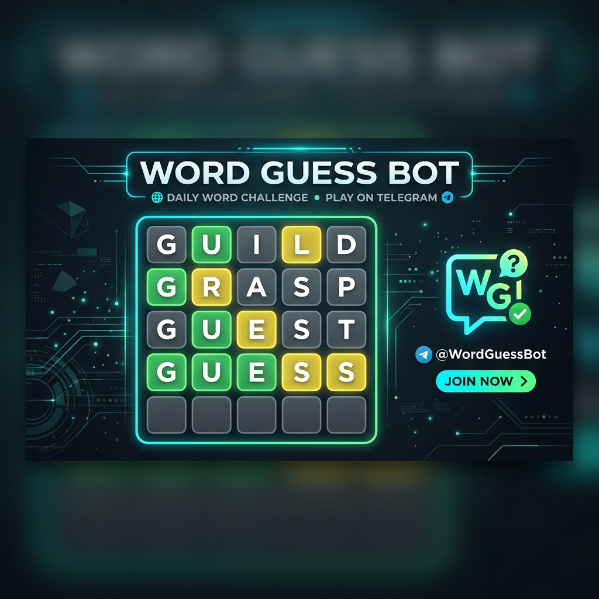

<div align="center">

<h2>Word Guess Bot</h2>

<b>A production-ready Telegram Wordle-style Bot</b><br>
Fully async, modular, and built to scale across thousands of groups.

<a href="https://github.com/SenpaiLabs/Word-Guess-Bot/stargazers">
    
</a>
<a href="https://github.com/SenpaiLabs/Word-Guess-Bot/network/members">
    
</a>
<a href="https://github.com/SenpaiLabs/Word-Guess-Bot/blob/master/LICENSE">
    
</a>
<a href="https://www.python.org/">
    
</a>
<br>



Word Guess Bot lets your group play Wordle-style word guessing games directly in Telegram.<br>
Built with Python, Pyrogram, and MongoDB, it features AI word generation via Groq and is optimized for VPS or Docker.
</div>

<hr>

<h2>🔥 Features</h2>

- 🎯 Play 4, 5, or 6 letter Wordle games in <b>Telegram group chats</b>
- ⚡ In-place message editing for a clean chat experience (no spam)
- 🧠 Background AI word generation via <b>Groq API</b>
- 🏆 Global and per-group leaderboards, stats, and win streaks
- ⚙️ Easy deployment — optimized for Docker or VPS with `uv`
<hr>

<h2>☁️ Deployment</h2>

<h3>✔️ Prerequisites</h3>

- <a href="https://www.python.org">Python 3.12+</a> installed  
- MongoDB connection string (Atlas free tier works)
- Required variables like `API_ID`, `API_HASH`, and `BOT_TOKEN`

<details>
    <summary>
        <h3>Local / VPS Setup (using Bash & uv)</h3>
    </summary>

<h4>🐧 Linux / macOS / Windows</h4>

```bash
git clone https://github.com/SenpaiLabs/Word-Guess-Bot && cd Word-Guess-Bot

# Install uv (Linux/macOS)
curl -Ls https://astral.sh/uv/install.sh | sh
export PATH="$HOME/.local/bin:$PATH"

# (OR) Install uv (Windows PowerShell)
irm https://astral.sh/uv/install.ps1 | iex

# Install dependencies
uv sync

# Rename and configure environment variables
cp .env.example .env
# Edit .env with your credentials

# Start the bot
bash start
```

</details>

<details>
    <summary>
        <h3>Deploy with Docker (Recommended for Scale)</h3>
    </summary>

```bash
git clone https://github.com/SenpaiLabs/Word-Guess-Bot && cd Word-Guess-Bot

# Rename and configure environment variables
cp .env.example .env

# Run Docker Compose
docker compose up -d --build
```
</details>

<details>
    <summary>
        <h3>Deploy to Heroku</h3>
    </summary>

> Click on the button below to deploy on Heroku<br>
    <a href="https://dashboard.heroku.com/new?template=https://github.com/SenpaiLabs/Word-Guess-Bot">
        
    </a>
</details>

<hr>

<h2>⚙️ Configuration</h2>

Edit <code>.env</code> with your credentials:
<details>
    <summary>Here's an example of the .env file</summary>

```env
API_ID=123456
API_HASH=abcdef1234567890
BOT_TOKEN=123456:ABC-DEF
MONGO_URL=mongodb+srv://...
GROQ_API_KEY=gsk_... # Optional for AI word replenishment
```

> 📝 Check `config.py` for all available advanced options (like `MAX_ATTEMPTS` or `LUCKY_ROUND_CHANCE`).
</details>

<hr>

<h2>🧐 Usage</h2>

1. Add the bot to your Telegram group.  
2. Promote it to <b>admin</b> with delete messages permission (for clean gameplay).  
3. Use commands in the chat to play:
<details>
    <summary>Commands overview</summary>
    <pre>
/new -> Start a game (random length 4/5/6)
/new4 or /new5 or /new6 -> Start a game with specific length
/game -> Show current game info
/setmode normal|medium|hard -> (Admin) Set difficulty for future games
/end -> (Admin) Reveal the answer and end current game
/leaderboard -> Top 10 players in this group
/gleaderboard -> Top 10 players globally
/mystats -> Your personal stats
    </pre>
</details>

<hr>

<h2>❤️ Contributing</h2>

Contributions are welcome!

1. Fork the repository.  
2. Create your branch: <code>git checkout -b feature/new</code>.  
4. Commit changes: <code>git commit -m 'New feature'</code>.  
5. Push: <code>git push origin feature/new</code>
6. Open a Pull Request.

<hr>

<h2>🗒️ License</h2>

This project is licensed under the <b>MIT License</b> — see <a href="https://github.com/SenpaiLabs/Word-Guess-Bot/blob/master/LICENSE">LICENSE</a> for details.

<hr>

<div align="center">

⭐ Enjoying the game? <b>Star the repo</b> — feedback keeps the rhythm going!

</div>
